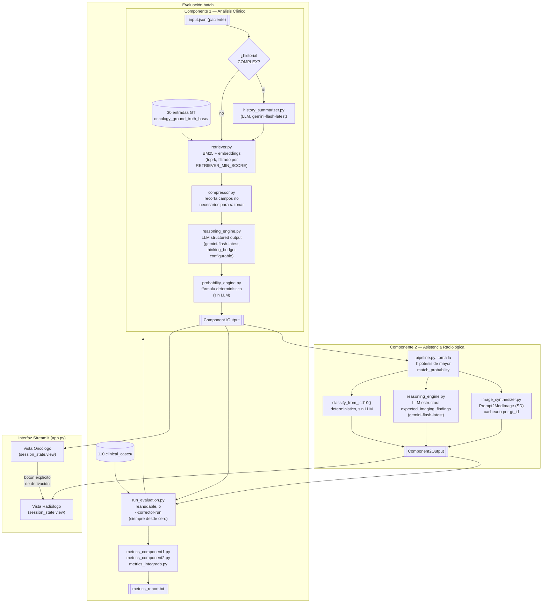

# OncoBridge AI

Sistema de apoyo a la decisión clínica (CDSS) para oncología. **Asiste, no reemplaza**: la decisión diagnóstica y terapéutica final es siempre del médico especialista.

Trabajo final — *IA Generativa para Biomedicina*, Universidad Austral.

---

## 1. Descripción del proyecto y objetivos

OncoBridge resuelve un problema concreto: una empresa de salud digital tiene una base de conocimiento oncológico curada (biomarcadores, presentaciones clínicas, guías de imagen) que ningún médico puede revisar manualmente en el tiempo real de una consulta. El sistema consulta automáticamente esa base y entrega, en el momento de la consulta, la información correcta al oncólogo y al especialista en imágenes.

El sistema tiene dos componentes secuenciales:

- **Componente 1 (análisis clínico):** recibe los datos de un paciente (síntomas, historial, laboratorio), recupera por RAG las entradas más relevantes de la base de ground truth oncológico, y devuelve hipótesis diagnósticas rankeadas con una recomendación de derivación a estudio de imagen. La `imaging_needed_probability` sale de una **fórmula determinística**, no de un número libre del LLM.
- **Componente 2 (asistencia radiológica):** recibe el output de Componente 1 y genera, para la hipótesis de mayor probabilidad, una **imagen de referencia ilustrativa** (no hay estudio de imagen real de ningún paciente en el dataset — ver Limitaciones) más un informe estructurado de qué debería buscar el radiólogo.

Además del pipeline, el proyecto incluye una **interfaz Streamlit** (§5.7) que corre el sistema real de punta a punta en un flujo secuencial de un solo caso (consulta oncológica → derivación explícita → informe de imágenes), pensada para que cualquiera (no técnico) pueda ver el sistema funcionando sin tocar la terminal.

Objetivo de aprendizaje: aplicar RAG, gestión de contexto bajo restricción de tokens, structured output, y evaluación crítica de un sistema de IA generativa en un dominio de alto riesgo clínico.

---

## 2. Arquitectura



**Decisiones clave y por qué:**

- **RAG (BM25 + embeddings), sin FAISS/LangChain:** con 30 entradas, un índice aproximado es sobre-ingeniería; código propio y auditable permite justificar exactamente qué se comprime y qué se cachea (criterio de evaluación explícito de la consigna).
- **`imaging_needed_probability` es una fórmula, no un output libre del LLM:** `max(match_probability × urgency_weight)` sobre las hipótesis matcheadas — toma el máximo, no el promedio, porque una sola hipótesis urgente y probable alcanza para recomendar derivación.
- **Compresión de contexto por etapas:** cada entrada GT candidata se recorta (`compressor.py`) a solo los campos clínicos relevantes antes de entrar al prompt de razonamiento — mide ~50% de reducción de tokens (30 GT reales: 21.571 → 10.654 tokens, `cl100k_base`). Además, `RETRIEVER_MIN_SCORE` descarta candidatos con score combinado (BM25 + embeddings) por debajo de un umbral **antes** de tomar el top-k, para no gastar tokens de prompt en candidatos irrelevantes que solo rellenaban la lista.
- **`thinking_budget` configurable (`LLM_THINKING_BUDGET`):** Gemini 2.5+ son modelos de "razonamiento híbrido" — gastan tokens de pensamiento interno antes de responder, que no se ven en el output pero sí consumen tiempo. Medimos el impacto real de bajarlo (de dinámico a un valor fijo chico) y **no encontramos una reducción de latencia significativa** en este caso de uso — la latencia dominante resultó ser la generación del output estructurado en sí (varios campos de texto libre), no el razonamiento interno. Se documenta como hallazgo, no como optimización efectiva.
- **Un solo modelo para las tres tareas (`gemini-flash-latest`):** originalmente usábamos `gemini-2.5-flash-lite` para el resumen de historial (más económico) y `gemini-2.5-flash` para razonamiento/visión. Este año Google dejó de dar acceso a versiones puntuales de Gemini 2.5 para API keys nuevas (confirmado en el foro de desarrolladores de Google), lo que rompió la corrida con una key recién emitida. Se migró todo a `gemini-flash-latest`, el alias que Google mantiene apuntando al modelo flash vigente — evita que este problema se repita y simplifica el manejo de cuota (un solo modelo, no dos límites distintos que trackear).
- **Reintento consciente del límite por minuto:** el free tier de Gemini tiene, además del límite diario, un límite de **solicitudes por minuto** (5 req/min observado en la práctica) que devuelve el mismo código 429 que la cuota diaria pero con una `quotaId` distinta. `llm/client.py` distingue ambos casos: la cuota diaria corta toda la corrida (no vale la pena reintentar), el límite por minuto espera el tiempo que la propia API sugiere (`retryDelay`) y reintenta el mismo caso.
- **Componente 2 sin imagen real de paciente:** el dataset es "clinical-only". En vez de simular una comparación metodológicamente cuestionable, C2 genera una imagen **ilustrativa** de referencia (a partir de los prompts ya definidos en el ground truth) y un informe que describe qué debería ver el radiólogo — sin comparar contra ningún estudio real.
- **`classification` y `confidence` en C2 son determinísticos:** `classification` sale de la regla de código ICD-10 (`C` = maligno, `D00-D36` = benigno, `D37-D48` = comportamiento incierto, validada contra los 30 códigos reales); `confidence` es directamente el `match_probability` que ya calculó C1 — C2 no inventa un número nuevo.

---

## 3. Limitaciones conocidas y trabajo futuro

- **No hay imagen real de ningún paciente.** El dataset provisto es "clinical-only". La imagen que genera Componente 2 es una referencia ilustrativa (Stable Diffusion afinado en radiología — `Nihirc/Prompt2MedImage`), cacheada **por diagnóstico** (`gt_id`), no por paciente: dos pacientes con la misma hipótesis principal ven la misma imagen. No es una simulación clínicamente validada.
- **La "segmentación" de C2 es semántica, no algorítmica.** No hay máscaras de píxeles reales ni anotaciones para entrenarlas o validarlas: `segmentation.regions_of_interest` lo redacta un LLM a partir de las zonas descriptas en el ground truth, con tamaños/formas marcados explícitamente como "referencia orientativa, no medición real".
- **Las métricas de C2 son proxies honestos, no la métrica literal de la consigna** (no automatizables sin imagen real anotada):
  - *Precisión de Segmentación (IoU)* → IoU de **texto** (Jaccard de palabras entre zonas reportadas y zonas reales), no de píxeles. El valor bajo obtenido (0.18, ver §4) probablemente refleja esta limitación del proxy —el LLM redacta las zonas en lenguaje clínico libre, mientras que el ground truth usa términos fijos— más que un fallo real de localización.
  - *Sensibilidad/Especificidad de Hallazgos (100%/100%, ver §4)*: esta métrica **hay que leerla con cuidado**. `classification` en C2 sale de la misma función determinística (`classify_from_icd10`) aplicada al mismo `gt_id` que ya identificó Componente 1 como hipótesis principal. Por diseño, esto hace que el número esté midiendo casi lo mismo que la "Precisión de GT Match" de C1 (91.0%, sobre los casos donde C2 corrió), no una capacidad independiente de Componente 2 de detectar hallazgos en una imagen real. Se documenta así explícitamente para no sobrevender el resultado.
- **Calibración débil (0.39, ver §4).** La correlación entre `match_probability` (la confianza que reporta el LLM) y si esa hipótesis efectivamente era la correcta es baja — el sistema no está mal calibrado en el sentido de "siempre equivocado", pero su número de confianza no es un predictor fuerte de acierto. Limitación conocida de confianza reportada por LLMs, no corregida en esta versión.
- **3 métricas de la consigna son evaluación humana, no automatizable:** Coherencia del Razonamiento (C1), Calidad del Informe (C2), y Satisfacción del Especialista (Sistema Integrado). Se recolectan con `scripts/collect_specialist_feedback.py` y se promedian automáticamente en el reporte batch — **pendientes hasta que especialistas reales prueben la demo**.
- **"Reducción de Tiempo de Triage" compara contra literatura, no un ensayo propio.** El "tiempo con sistema" se mide de verdad (cronometrado, sumando Componente 1 y, cuando corresponde, Componente 2); el "tiempo sin sistema" cita Overhage & McCallie (*Annals of Internal Medicine*, 2020;172:169-174: revisión de historial = 33% de 16 min 14 seg promedio por consulta, 155.000 médicos en EE.UU.) — no es un experimento controlado con estos mismos pacientes, y esa referencia mide revisión de historial en general, no específica de oncología.
- **6 de 110 casos del dataset no tienen `correct_gt_ids`** (5 benigno-fisiológicos + un caso de sarcoma retroperitoneal que la base GT no cubre). La métrica de "Precisión de GT Match" los excluye de su denominador (se calcula sobre 89/110 — ver §4 — el resto son casos donde además Componente 1 no matcheó ninguna hipótesis) porque no existe ningún `gt_id` correcto contra el cual comparar — el resto de las métricas (accuracy de derivación, sensibilidad, especificidad, `conclusive`) sí los incluye, porque para esas sí hay una respuesta correcta bien definida.
- **El free tier de Gemini tiene dos límites de cuota distintos**, no solo uno: ~20 llamadas/día por modelo, **y además un límite de solicitudes por minuto (5 req/min observado)**. Este segundo límite es, en la práctica, la restricción más dura: con ~200 llamadas necesarias para los 110 casos, el piso teórico de tiempo (aun con todo funcionando perfecto) puede superar ampliamente los 10 minutos si la API key usada es de free tier — ver la nota en §5.6 sobre cómo esto afecta la guía de ejecución.
- **Trabajo futuro:** explorar segmentación real si en el futuro se dispone de imágenes anotadas; ampliar la base GT más allá de 30 entradas y confirmar que el retriever escala; paralelizar la evaluación batch (llamadas concurrentes) si se dispone de una API key con mayor límite de RPM, para acortar el tiempo total de la corrida completa.

---

## 4. Dataset de evaluación y resultados obtenidos

**Base de ground truth:** 30 entradas (`data/dataset_clinical_only/dataset/oncology_ground_truth_base/`) — neoplasias malignas (pulmón, colon, riñón, hígado, páncreas, tiroides, linfoma, etc.) y diferenciales no oncológicos (neumonía, colitis, pielonefritis, TBC) usados para descartar cáncer activamente.

**Casos clínicos:** 110 (`data/dataset_clinical_only/dataset/clinical_cases/`), con la composición mínima que exige la consigna (TP/TN/FP/FN/multimodales).

**Resultados obtenidos — corrida completa de los 110/110 casos** (`python scripts/run_evaluation.py --corrector-run`, reporte completo versionado en `evaluation/results/metrics_report.txt`):

```
--- Componente 1 (N=110) ---
Accuracy de derivación:       70.9%
Sensibilidad:                 93.6%
Especificidad:                84.4%
Precisión de GT match:        91.0% (sobre 89/110 casos aplicables)
Calibración (prob. vs acierto): 0.39
Tokens promedio por caso:     2934

--- Componente 2 (N=78) ---
Sensibilidad de hallazgos:    100.0%
Especificidad de hallazgos:   100.0%
Precisión de Segmentación (IoU proxy): 0.18
Concordancia clínica:        sin datos suficientes

--- Sistema Integrado ---
Tasa de Imagen Innecesaria:   6.4%
Tiempo con sistema (medido, C1 + C2 cuando corresponde): [pendiente de refrescar tras
  corregir la métrica para que sume C2 en los casos derivados -- correr
  `python scripts/run_evaluation.py --corrector-run` una vez más y actualizar
  este número antes de la entrega final]
Reducción estimada vs. referencia citada: [ídem]
```

> ⚠️ La línea de "Tiempo con sistema" quedó desactualizada por un fix aplicado sobre la marcha (antes solo sumaba el tiempo de Componente 1; ahora suma también Componente 2 en los casos que efectivamente derivan a imagen). El resto de los números de esta tabla son los reales de la última corrida completa. Correr `--corrector-run` una vez más para tener el número corregido y reemplazar este placeholder antes de entregar.

**Lectura honesta de estos números** (ver también §3): sensibilidad y especificidad de derivación son sólidas (93.6% / 84.4%), y la precisión de GT match (91%) muestra que el retriever + razonamiento identifican bien la hipótesis correcta. La accuracy de derivación (70.9%) es más baja porque exige un match exacto entre 4 categorías posibles, no solo el binario "necesita imagen sí/no". La sensibilidad/especificidad de Componente 2 al 100% debe leerse con la salvedad de arriba (§3) — no es una medición independiente de C2. Las 3 métricas de evaluación humana quedan pendientes de una corrida de `scripts/collect_specialist_feedback.py` con especialistas reales.

---

## 5. Guía de ejecución

Con Python 3.10+ instalado, seguí estos pasos en orden.

### 5.1 Instalación de dependencias

```bash
python -m venv venv
venv\Scripts\activate          # Windows
# source venv/bin/activate     # Linux/Mac
pip install -r requirements.txt
```

> Primera vez: `torch`/`diffusers`/`sentence-transformers` son librerías pesadas — la instalación puede tardar varios minutos según tu conexión.

### 5.2 Configuración de variables de entorno

```bash
cp .env.example .env
```

Editá `.env` y completá `GEMINI_API_KEY` con tu propia key de [Google AI Studio](https://aistudio.google.com/apikey). El resto de las variables ya tienen valores por defecto razonables — no hace falta tocarlas para correr el sistema:

- `LLM_MODEL_REASONING` / `LLM_MODEL_SUMMARIZATION` / `LLM_MODEL_VISION` → `gemini-flash-latest` (alias de Google al modelo flash vigente; ver §2 sobre por qué no fijamos una versión puntual).
- `RETRIEVER_MIN_SCORE` (default `0.15`) → filtra candidatos irrelevantes del retriever antes de armar el prompt.
- `LLM_THINKING_BUDGET` (default `512`) → tokens de razonamiento interno del modelo antes de responder; `-1` = dinámico (comportamiento sin este knob), `0` = lo apaga del todo.

### 5.3 Cómo correr el Componente 1

```bash
python scripts/run_component1.py --case case_001
```

**Input** (`data/dataset_clinical_only/dataset/clinical_cases/case_001/input.json`): paciente masculino de 63 años, hematuria macroscópica, dolor lumbar izquierdo, masa palpable en flanco izquierdo, antecedente familiar de carcinoma renal.

**Output esperado en consola** (recortado; JSON completo real en `evaluation/results/batch_results.json` → `case_001.c1_output`):
```json
{
  "patient_id": "PAT-00101",
  "clinical_summary": "Paciente masculino de 63 años con antecedentes de tabaquismo (30 paquetes-año), hipertensión arterial y antecedente familiar de carcinoma renal (padre). Presenta la tríada clásica de hematuria macroscópica intermitente de 3 semanas, dolor lumbar izquierdo persistente y masa palpable en flanco izquierdo...",
  "matched_ground_truths": [
    {
      "gt_id": "GT-RENAL-001",
      "icd_10": "C64.9",
      "icd_10_description": "Neoplasia maligna del rinon (carcinoma de celulas renales)",
      "match_probability": 0.95,
      "match_rationale": "El paciente presenta la tríada clásica completa (hematuria macroscópica, dolor lumbar y masa palpable en flanco), junto con factores de riesgo mayores (tabaquismo, hipertensión, edad y antecedente familiar de carcinoma renal)..."
    }
  ],
  "imaging_needed_probability": 0.95,
  "recommendation": "DERIVAR_A_IMAGEN",
  "urgency": "alta",
  "conclusive": true,
  "token_usage": { "prompt_tokens": 2254, "completion_tokens": 610, "total_tokens": 2864, "model": "gemini-flash-latest", "retrieved_gt_entries": 5, "gt_entries_in_context": 5 }
}
```

### 5.4 Cómo correr el Componente 2

Componente 2 recibe el output de Componente 1 como input (no hay estudio de imagen real de paciente en el dataset — ver §3). Este comando corre C1 internamente para producir ese input, e imprime el output de C2:

```bash
python scripts/run_component2.py --case case_001
```

**Output esperado** (recortado; JSON completo real en `evaluation/results/batch_results.json` → `case_001.c2_output`):
```json
{
  "patient_id": "PAT-00101",
  "segmentation": {
    "regions_of_interest": [
      { "id": "ROI_01", "location": "Corteza y seno del rinon derecho", "size_mm": 65.0, "shape": "Lobulada e irregular (valor estimativo de referencia)" }
    ]
  },
  "findings": "Se espera observar una masa renal solida y heterogenea localizada en el rinon derecho (afectando corteza y seno renal), caracterizada por un realce tras la administracion de contraste y posterior lavado (washout), con margenes irregulares...",
  "classification": "sospechoso",
  "confidence": 0.95,
  "final_recommendation": "Se recomienda realizar una tomografia computarizada (TC) de abdomen y pelvis con protocolo renal multifasico (fases corticomedular, nefrografica y excretora) para caracterizar la masa y delimitar la extension del trombo venoso...",
  "next_steps": ["Evaluacion urgente por el servicio de Urologia y Oncologia Medica.", "Completar estadificacion con tomografia de torax para descartar secundarismo pulmonar.", "..."]
}

Imagen de referencia: data/generated/reference_images/GT-RENAL-001.png
```

### 5.5 Cómo correr el flujo end-to-end

```bash
python scripts/run_e2e.py --case case_002
```

Corre Componente 1 y, si recomienda `DERIVAR_A_IMAGEN`, encadena automáticamente Componente 2 sobre el mismo caso, imprimiendo ambos outputs y la ruta de la imagen generada.

### 5.6 Cómo correr el script de evaluación

```bash
python scripts/run_evaluation.py --corrector-run
```

Corre C1 (y C2 cuando corresponde) sobre los **110 casos, siempre desde cero** (ignora cualquier resultado guardado de una corrida anterior), guarda cada resultado en `evaluation/results/batch_results.json` a medida que lo procesa, y al final imprime **y guarda** el reporte completo en `evaluation/results/metrics_report.txt` (métricas de C1, C2 y Sistema Integrado).

> ⚠️ **Nota importante sobre el tiempo de esta corrida.** El free tier de Gemini tiene un límite de ~5 solicitudes por minuto (además del límite diario) — ver §3. Con ~200 llamadas necesarias para los 110 casos, esta corrida completa puede tardar **bien más de 10 minutos** en una API key de free tier, aunque el sistema funcione correctamente (el script espera automáticamente y reintenta cuando pega contra ese límite, no falla). Para verificar que el sistema funciona dentro de los 10 minutos sin depender del tier de la API key:
> ```bash
> python scripts/run_evaluation.py --report-only   # imprime el reporte acumulado sin llamar al LLM
> ```
> Los resultados completos de los 110 casos ya están versionados en este repositorio (`evaluation/results/batch_results.json` y `evaluation/results/metrics_report.txt`, ver §4) — no hace falta volver a correrlos desde cero para verlos.

Para recolectar las 3 métricas de evaluación humana (Coherencia del Razonamiento, Calidad del Informe, Satisfacción del Especialista), un especialista corre:
```bash
python scripts/collect_specialist_feedback.py
```
El reporte del paso anterior las incorpora automáticamente apenas exista al menos una respuesta guardada.

### 5.7 Cómo correr la interfaz (Streamlit)

Sección complementaria a la guía de ejecución obligatoria (§5.1-§5.6) — corre el sistema real (no una demo) con una interfaz gráfica, pensada para una audiencia no técnica:

```bash
streamlit run src/oncobridge/ui/app.py --server.fileWatcherType none
```

Se abre en `http://localhost:8501`. Flujo: elegís un paciente (del dataset de 110 casos, o cargás uno nuevo con el formulario), el sistema corre Componente 1 real, y si recomienda derivar a imagen, un botón explícito pasa a la vista del especialista en imágenes (Componente 2 real, con la imagen de referencia generada). La primera carga puede tardar unos segundos mientras se importa el modelo de embeddings — no es un error, es esperado.
