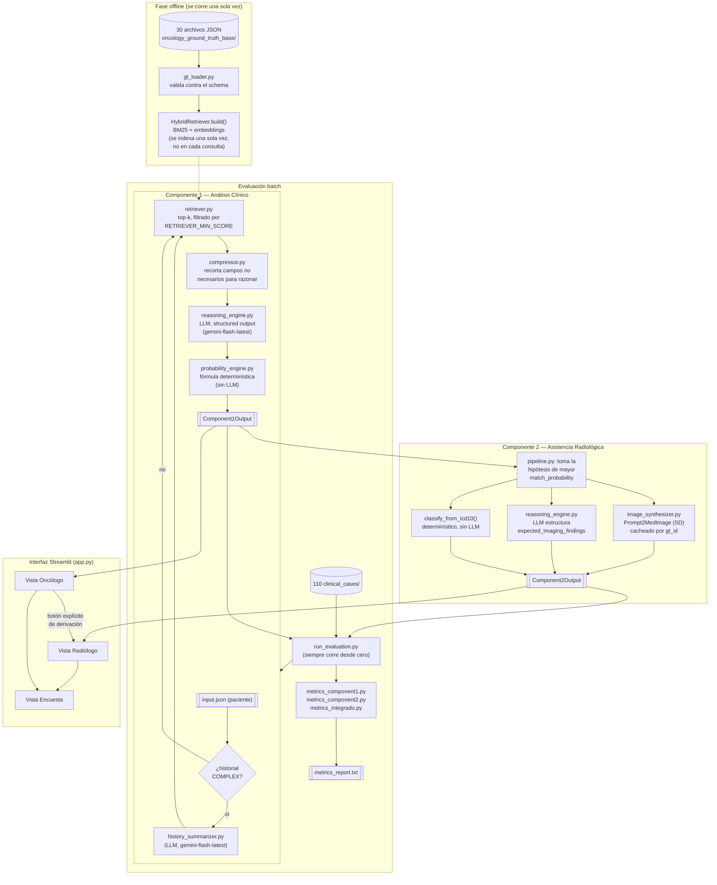

# OncoBridge AI

Sistema de apoyo a la decisión clínica (CDSS) para oncología, desarrollado como trabajo final de *IA Generativa aplicada a Biomedicina* (Universidad Austral).

**Asiste, no reemplaza.** Todo lo que devuelve el sistema es una recomendación para que el oncólogo y el especialista en imágenes revisen — la decisión diagnóstica y terapéutica sigue siendo siempre del médico.

---

## Introducción

Partimos de un problema bastante concreto: un centro de salud tiene una base de conocimiento oncológico curada por especialistas (biomarcadores, presentaciones clínicas típicas, guías de qué buscar en una imagen para cada diagnóstico), pero ningún médico tiene tiempo, en el momento de una consulta, de revisarla entera para ver si el caso que tiene enfrente encaja con alguna de esas entradas. OncoBridge AI hace ese cruce automáticamente: toma los datos de un paciente, busca en la base cuáles son las hipótesis diagnósticas más compatibles, y arma una recomendación de si conviene o no derivar a un estudio de imagen — y si conviene, le da al especialista en imágenes una guía concreta de qué esperar encontrar.

El sistema está pensado como dos pasos secuenciales, imitando el flujo real de una consulta: primero pasa por el oncólogo (análisis clínico), y solo si el oncólogo decide derivar, pasa por el especialista en imágenes (asistencia radiológica). Nunca al revés, y nunca automático — la derivación es siempre una decisión explícita.

Para construirlo usamos, entre otras cosas: **RAG** (retrieval-augmented generation) con un retriever propio combinando búsqueda léxica y semántica, la **API de Gemini** con salida estructurada (structured outputs) para que el modelo devuelva siempre un JSON válido y predecible, y **Stable Diffusion** para generar una imagen de referencia ilustrativa cuando hace falta. Todo el pipeline se puede correr por línea de comandos o desde una interfaz en Streamlit.

## Objetivos

- Aplicar RAG sobre una base de conocimiento chica pero especializada, priorizando poder auditar exactamente qué información llega al modelo y por qué.
- Diseñar un pipeline de razonamiento clínico donde las decisiones críticas (si hace falta imagen, con qué urgencia, qué tan probable es cada hipótesis) salgan de fórmulas determinísticas y no de texto libre generado por el LLM.
- Manejar el contexto de forma eficiente: medir cuántos tokens se ahorran comprimiendo y filtrando lo que se le manda al modelo, en vez de asumir que "más contexto es mejor".
- Evaluar el sistema de punta a punta contra un dataset de 110 casos clínicos, con métricas automáticas donde se puede medir objetivamente, y encuestas a especialistas donde no.
- Entregar un sistema que cualquier persona con Python pueda instalar y correr desde cero, sin depender de que hayamos dejado algo funcionando "de casualidad" en nuestras máquinas.

## Arquitectura general

El sistema tiene una fase que se corre una única vez (cargar y preparar la base de conocimiento) y dos componentes que se corren por cada paciente: Componente 1 hace el análisis clínico y decide si hace falta imagen; Componente 2, si corresponde, arma la asistencia para el especialista en imágenes. Alrededor de esos dos componentes hay un script de evaluación batch (que corre los 110 casos del dataset y calcula métricas) y una interfaz en Streamlit para usar el sistema sin tocar la terminal.

## Decisiones de diseño

**Elegimos RAG en vez de meter todo el conocimiento en el prompt o depender de que el modelo "ya sepa" oncología.** La base de conocimiento tiene 30 entradas curadas, cada una con biomarcadores, síntomas típicos y guías de imagen específicas. Mandarlas todas en cada llamada sería carísimo en tokens y le daría al modelo un montón de información irrelevante para el paciente puntual que se está evaluando. Con RAG, el modelo solo ve las entradas que realmente compiten como diagnóstico para ese paciente.

**Implementamos un retriever híbrido (BM25 + embeddings) en vez de usar solo uno de los dos.** BM25 es fuerte para encontrar coincidencias léxicas exactas (un síntoma o biomarcador mencionado con las mismas palabras), pero se pierde las coincidencias semánticas (dos formas distintas de describir lo mismo). Los embeddings capturan esa semántica pero pueden fallar en textos técnicos cortos. Combinar los dos scores nos da una recuperación más robusta que cualquiera de los dos por separado.

**Decidimos no usar FAISS ni un framework tipo LangChain para el RAG.** Con 30 entradas, un índice vectorial aproximado es más complejidad de la que el problema necesita — construir el retriever a mano nos permite auditar exactamente qué se compara, qué score se le asigna a cada candidato y por qué se descarta uno, algo que se vuelve más opaco atrás de una librería de alto nivel.

**Agregamos un compressor de contexto (`compressor.py`) que recorta cada entrada de la base antes de mandarla al modelo.** Cada entrada del ground truth tiene campos que sirven para armar el reporte final (por ejemplo, el prompt para generar la imagen) pero que no le aportan nada al modelo a la hora de decidir si el paciente matchea ese diagnóstico. Sacarlos del prompt de razonamiento reduce el consumo de tokens sin perder información relevante para la decisión.

**Usamos salida estructurada (Structured Outputs) en cada llamada al modelo en vez de parsear texto libre.** Le pasamos a la API un schema de Pydantic y la API garantiza que la respuesta lo cumple exactamente. Esto nos saca de encima todo el trabajo (y toda la fragilidad) de tener que parsear con regex una respuesta en lenguaje natural, y nos deja construir el resto del pipeline sobre un contrato de datos confiable.

**Componente 2 solo genera la imagen de referencia de la hipótesis con mayor `match_probability`, no de todas.** Generar una imagen por cada hipótesis matcheada multiplicaría el tiempo y el costo sin aportar demasiado — clínicamente, lo primero que necesita el especialista en imágenes es orientación sobre el diagnóstico más probable, no un catálogo de todas las posibilidades.

**Adaptamos por completo el diseño de Componente 2 porque el dataset no tiene ninguna imagen real de paciente.** Es un dataset "solo clínico": los datos de laboratorio, síntomas e historial son reales, pero no hay estudios de imagen para comparar. En vez de simular una comparación contra una imagen que no existe (lo cual hubiera sido metodológicamente cuestionable), Componente 2 genera una imagen ilustrativa a partir de las guías de imagen ya definidas en el ground truth, y arma un informe de qué debería buscar el especialista — dejando explícito en todo momento que es una referencia, no un estudio real.

**Para esa imagen usamos `Nihirc/Prompt2MedImage` en vez de un checkpoint de Stable Diffusion genérico.** Es un modelo de Hugging Face afinado específicamente sobre imágenes médicas reales (el dataset ROCO), pero compatible con la misma API de `diffusers` que un Stable Diffusion estándar. Probamos primero con un checkpoint genérico y las imágenes no se parecían en nada a un estudio médico real; con Prompt2MedImage, al estar entrenado sobre ese dominio, el resultado es muchísimo más creíble como referencia visual para un radiólogo, sin tener que entrenar ni afinar nada nosotros.

**Separamos el sistema en dos componentes secuenciales en vez de un único agente que haga todo.** Refleja el flujo real de una consulta: un oncólogo evalúa primero al paciente y decide si hace falta imagen; recién ahí entra el especialista en imágenes. Mantener esa secuencia como dos pasos explícitos (con una derivación que el usuario tiene que confirmar, nunca automática) hace que el sistema sea más fácil de auditar componente por componente, y refuerza la idea de que el sistema asiste pero no decide solo.

### Así se arma todo junto



## Componentes del sistema

### Fase offline

Antes de poder analizar a un solo paciente, el sistema necesita preparar la base de conocimiento. Esto pasa una única vez por ejecución (no en cada consulta): `gt_loader.py` lee los 30 archivos JSON de la base de ground truth y los valida contra un schema de Pydantic, y después `HybridRetriever.build()` construye el índice BM25 y calcula los embeddings de las 30 entradas. Separar esta construcción del momento de la consulta importa porque calcular embeddings tiene un costo (carga un modelo de `sentence-transformers`) que no tiene sentido pagar por cada paciente — se paga una vez, y después cada consulta solo hace una comparación contra ese índice ya armado.

### Componente 1 — Análisis Clínico

Acá pasa la mayor parte del razonamiento del sistema. La idea del pipeline, paso por paso:

1. **Si el historial clínico del paciente es largo** (más de `COMPLEX_HISTORY_THRESHOLD` eventos), se resume primero con una llamada al LLM. Para la mayoría de los casos del dataset esto ni siquiera hace falta — es un paso condicional, no gasta una llamada si el historial ya es corto.
2. **El retriever busca, entre las 30 entradas de la base, cuáles son candidatas** a ser el diagnóstico del paciente. No le mandamos las 30 al modelo: el retriever combina el score de BM25 (coincidencia de palabras) con el de embeddings (similitud semántica), y se queda con el top-k de mayor score combinado — descartando además cualquier candidato que quede por debajo de `RETRIEVER_MIN_SCORE`, aunque entre en el top-k, porque no tiene sentido gastarle tokens al modelo en una entrada que ni siquiera se parece al caso.
3. **El compressor recorta cada candidato** que sobrevivió el filtro anterior, dejando solo los campos que sirven para decidir si matchea (síntomas, biomarcadores, factores de riesgo) y sacando los que solo sirven para el reporte final (como el prompt de generación de imagen).
4. **El LLM recibe los datos del paciente más esos candidatos ya comprimidos**, y devuelve, con salida estructurada, un resumen clínico, las hipótesis que realmente matchean (con su probabilidad y una justificación), y si el cuadro es concluyente o no.
5. **La probabilidad de necesitar imagen y la recomendación final no las decide el LLM**: salen de una fórmula determinística (`probability_engine.py`) que toma el máximo entre `match_probability × peso_de_urgencia` de las hipótesis matcheadas. Usamos el máximo y no el promedio porque una sola hipótesis urgente y probable ya alcanza para recomendar derivar, aunque el resto de las hipótesis matcheadas sean poco probables.

El resultado es un `Component1Output` con el resumen clínico, las hipótesis rankeadas, la probabilidad de necesitar imagen, la urgencia, y la recomendación (derivar a imagen, seguimiento clínico, no derivar, o datos insuficientes).

### Componente 2 — Asistencia Radiológica

Solo se ejecuta cuando Componente 1 recomienda derivar a imagen y matcheó al menos una hipótesis. Toma la hipótesis de mayor probabilidad y arma tres cosas:

- **Una imagen de referencia ilustrativa**, generada con Stable Diffusion (`Nihirc/Prompt2MedImage`, un checkpoint afinado con imágenes médicas reales) a partir del prompt ya definido en el ground truth para esa condición. Se cachea por diagnóstico (`gt_id`), no por paciente — si dos pacientes distintos matchean la misma hipótesis principal, la imagen no se regenera.
- **Un informe estructurado** (hallazgos esperados, regiones de interés, recomendación final y próximos pasos), armado por un LLM a partir de la guía de imagen que ya trae el ground truth — acá el modelo estructura y redacta, no inventa un diagnóstico nuevo.
- **Una clasificación y una confianza, calculadas sin LLM.** La clasificación sale de una regla determinística sobre el código ICD-10 (códigos que empiezan con `C` son malignos, `D00-D36` benignos, `D37-D48` de comportamiento incierto), y la confianza es directamente la `match_probability` que ya calculó Componente 1. Lo hicimos así para que Componente 2 no pueda, por las dudas, contradecir un dato del que el sistema ya tenía certeza.

### Optimizaciones aplicadas

| Optimización | Objetivo |
|---|---|
| Retriever híbrido (BM25 + embeddings) | Combinar coincidencia léxica y semántica al buscar candidatos |
| `RETRIEVER_MIN_SCORE` | Descartar candidatos irrelevantes antes de armar el prompt, aunque entren en el top-k |
| Compressor de contexto | Recortar cada candidato a los campos clínicamente relevantes, reduciendo tokens |
| History summarizer condicional | Resumir historiales largos solo cuando hace falta, sin gastar una llamada de más en el resto |
| Structured Outputs (Pydantic + `response_schema`) | Garantizar que cada respuesta del modelo cumpla el contrato de datos, sin parsear texto libre |
| `LLM_THINKING_BUDGET` configurable | Poder ajustar cuánto "piensa" el modelo antes de responder |
| Reintento consciente del límite por minuto | Distinguir un límite de cuota recuperable (esperar y reintentar) de uno que corta la corrida (cuota diaria agotada) |
| Caché de imágenes por `gt_id` | Evitar regenerar la misma imagen si distintos pacientes matchean el mismo diagnóstico |

## Tecnologías utilizadas

| Tecnología | Uso en el proyecto |
|---|---|
| Python 3.10+ | Lenguaje del proyecto |
| Pydantic | Validación y contratos de datos entre componentes |
| `google-genai` (Gemini API) | LLM para razonamiento clínico y redacción de informes, con salida estructurada |
| `rank-bm25` | Búsqueda léxica del retriever híbrido |
| `sentence-transformers` | Embeddings semánticos para el retriever híbrido |
| `tiktoken` | Conteo de tokens para medir la eficiencia del compressor |
| `diffusers` + `torch` | Generación de la imagen de referencia (Stable Diffusion) |
| Streamlit | Interfaz gráfica del sistema |
| `pytest` | Tests automatizados |
| `pandas` | Tablas editables en el formulario de paciente nuevo de la interfaz |

## Organización del repositorio

```
src/oncobridge/
├── ingestion/       # Carga y validación de la base de ground truth
├── rag/              # Retriever híbrido y compressor de contexto
├── llm/              # Cliente único de Gemini (reintentos, thinking budget)
├── component1/       # Pipeline de análisis clínico
├── component2/       # Pipeline de asistencia radiológica + generación de imagen
├── evaluation/       # Métricas de C1, C2, Sistema Integrado, y feedback de especialistas
├── schemas/          # Contratos de datos (Pydantic) de cada componente
└── ui/                # Interfaz Streamlit (oncólogo, radiólogo, encuesta)

scripts/              # CLIs: correr un componente, el flujo completo, o la evaluación batch
data/                 # Dataset (base de ground truth + 110 casos clínicos)
evaluation/results/   # Resultados guardados de la evaluación batch
tests/                # Tests automatizados
colab/                # Notebook para generar las imágenes de referencia con GPU
```

## Instalación

Con Python 3.10+ instalado, seguí estos pasos en orden.

### Instalación de dependencias

```bash
python -m venv venv
venv\Scripts\activate          # Windows
# source venv/bin/activate     # Linux/Mac
pip install -r requirements.txt
```

> Primera vez: `torch`/`diffusers`/`sentence-transformers` son librerías pesadas — la instalación puede tardar varios minutos según tu conexión.

## Configuración

```bash
cp .env.example .env
```

Editá `.env` y completá `GEMINI_API_KEY` con tu propia key de [Google AI Studio](https://aistudio.google.com/apikey). El resto de las variables ya tienen valores por defecto razonables — no hace falta tocarlas para correr el sistema:

- `LLM_MODEL_REASONING` / `LLM_MODEL_SUMMARIZATION` / `LLM_MODEL_VISION` → `gemini-flash-latest` (el alias que Google mantiene apuntando al modelo flash vigente, en vez de fijar una versión puntual que en algún momento puede dejar de estar disponible).
- `RETRIEVER_TOP_K` (default `3`) → cuántos candidatos como máximo le llegan al modelo por consulta.
- `RETRIEVER_MIN_SCORE` (default `0.15`) → filtra candidatos irrelevantes del retriever antes de armar el prompt.
- `LLM_THINKING_BUDGET` (default `256`) → tokens de razonamiento interno del modelo antes de responder; `-1` significa dinámico (el modelo decide solo), `0` lo apaga del todo.

## Ejecución

### Cómo correr el Componente 1

```bash
python scripts/run_component1.py --case case_001
```

**Input** (`data/dataset_clinical_only/dataset/clinical_cases/case_001/input.json`): paciente masculino de 63 años, hematuria macroscópica, dolor lumbar izquierdo, masa palpable en flanco izquierdo, antecedente familiar de carcinoma renal.

**Output esperado en consola** (recortado; JSON completo real en `evaluation/results/batch_results.json` → `case_001.c1_output`):
```json
{
  "patient_id": "PAT-00101",
  "clinical_summary": "Paciente masculino de 63 años, fumador (30 paquetes-año), hipertenso y con antecedente familiar de carcinoma renal (padre). Presenta la tríada clásica de carcinoma de células renales: hematuria macroscópica intermitente de 3 semanas, dolor lumbar izquierdo persistente y masa palpable en flanco izquierdo...",
  "matched_ground_truths": [
    {
      "gt_id": "GT-RENAL-001",
      "icd_10": "C64.9",
      "icd_10_description": "Neoplasia maligna del rinon (carcinoma de celulas renales)",
      "match_probability": 0.95,
      "match_rationale": "El paciente cumple con la tríada sintomática clásica (hematuria macroscópica, dolor lumbar y masa palpable en flanco), presenta factores de riesgo clave (edad, tabaquismo, hipertensión y antecedente familiar de primer grado)..."
    }
  ],
  "imaging_needed_probability": 0.95,
  "recommendation": "DERIVAR_A_IMAGEN",
  "urgency": "alta",
  "conclusive": true,
  "token_usage": { "prompt_tokens": 1712, "completion_tokens": 599, "total_tokens": 2311, "model": "gemini-flash-latest", "retrieved_gt_entries": 3, "gt_entries_in_context": 3 }
}
```

### Cómo correr el Componente 2

Componente 2 recibe el output de Componente 1 como input (no hay estudio de imagen real de paciente en el dataset — ver Limitaciones). Este comando corre C1 internamente para producir ese input, e imprime el output de C2:

```bash
python scripts/run_component2.py --case case_001
```

**Output esperado** (recortado; JSON completo real en `evaluation/results/batch_results.json` → `case_001.c2_output`):
```json
{
  "patient_id": "PAT-00101",
  "segmentation": {
    "regions_of_interest": [
      { "id": "ROI-1", "location": "Corteza y seno renal del riñón derecho", "size_mm": 55.0, "shape": "Irregular / nodular" },
      { "id": "ROI-2", "location": "Vena renal derecha", "size_mm": 15.0, "shape": "Tubular / intraluminal" }
    ]
  },
  "findings": "Estudio orientado a la evaluación del riñón derecho. Se espera identificar una masa renal sólida y heterogénea con un patrón de realce característico tras la administración de contraste...",
  "classification": "sospechoso",
  "confidence": 0.95,
  "final_recommendation": "Realizar tomografía computarizada (TC) de abdomen y pelvis con protocolo renal multifásico (fases simple, corticomedular, nefrográfica y excretora) o resonancia magnética (RM) contrastada para caracterización tumoral completa...",
  "next_steps": ["Completar la estadificación sistémica mediante TC de tórax para descartar metástasis pulmonares.", "Evaluación urológica urgente para planificación quirúrgica...", "..."]
}

Imagen de referencia: data/generated/reference_images/GT-RENAL-001.png
```

### Cómo correr el flujo end-to-end

```bash
python scripts/run_e2e.py --case case_002
```

Corre Componente 1 y, si recomienda `DERIVAR_A_IMAGEN`, encadena automáticamente Componente 2 sobre el mismo caso, imprimiendo ambos outputs y la ruta de la imagen generada.

### Cómo correr el script de evaluación

```bash
python scripts/run_evaluation.py
```

Corre C1 (y C2 cuando corresponde) sobre los **110 casos, siempre desde cero** (ignora cualquier resultado guardado de una corrida anterior), guarda cada resultado en `evaluation/results/batch_results.json` a medida que lo procesa, y al final imprime **y guarda** el reporte completo en `evaluation/results/metrics_report.txt` (métricas de C1, C2 y Sistema Integrado).

> Para ver el sistema funcionar rápido sin depender del tier de la API key:
> ```bash
> python scripts/run_evaluation.py --limit 8       # corre solo 8 casos nuevos, real y rápido
> python scripts/run_evaluation.py --report-only   # imprime el reporte acumulado sin llamar al LLM
> ```
> Los resultados completos de los 110 casos ya están versionados en este repositorio (`evaluation/results/batch_results.json` y `evaluation/results/metrics_report.txt`, ver Resultados) — no hace falta volver a correrlos desde cero para verlos.

Para recolectar las métricas que dependen de evaluación humana (coherencia del razonamiento, calidad del informe, satisfacción del especialista), un especialista puede completar la encuesta desde la interfaz (ver más abajo) o correr:
```bash
python scripts/collect_specialist_feedback.py
```
El reporte de evaluación las incorpora automáticamente apenas exista al menos una respuesta guardada — quedan guardadas en `evaluation/results/specialist_feedback.json`.

### Cómo correr la interfaz (Streamlit)

Corre el sistema real (no una demo) con una interfaz gráfica, pensada para una audiencia no técnica:

```bash
streamlit run src/oncobridge/ui/app.py --server.fileWatcherType none
```

Se abre en `http://localhost:8501`, con tres pasos: **Consulta Oncológica** (elegís un paciente del dataset o cargás uno nuevo con el formulario, y el sistema corre Componente 1 real), **Informe de Imágenes** (si corresponde derivar, un botón explícito lleva a esta vista, donde corre Componente 2 real con la imagen de referencia generada) y **Encuesta** (para dejar feedback, que se integra automáticamente al reporte de evaluación). La primera carga puede tardar unos segundos mientras se importa el modelo de embeddings — no es un error, es esperado.

## Dataset

La base de conocimiento y los casos clínicos son parte del dataset provisto para el trabajo (`data/dataset_clinical_only/dataset/`), un dataset sintético pero clínicamente coherente: no hay pacientes reales, pero los cuadros, biomarcadores y guías de imagen fueron armados para ser representativos de presentaciones oncológicas reales.

| | Cantidad | Descripción |
|---|---|---|
| Entradas de ground truth | 30 | Neoplasias malignas (pulmón, colon, riñón, hígado, páncreas, tiroides, linfoma, etc.) y diferenciales no oncológicos (neumonía, colitis, pielonefritis, TBC) usados para descartar cáncer activamente |
| Casos clínicos | 110 | Pacientes de prueba, cada uno con su `input.json` (datos del paciente) y su `expected_output.json` (diagnóstico correcto esperado) |
| Verdaderos positivos | 30 | Casos que sí necesitan derivarse a imagen, con diagnóstico oncológico real |
| Verdaderos negativos | 30 | Casos benignos o fisiológicos que no necesitan imagen |
| Falsos positivos | 15 | Casos que parecen sospechosos pero no lo son |
| Falsos negativos | 15 | Casos que sí necesitan imagen pero con presentación atípica |
| Casos complejos | 20 | Historiales clínicos largos, disparan el resumen automático antes de razonar |

Durante la evaluación, cada uno de los 110 casos se corre de punta a punta contra el sistema real, y el `expected_output.json` de cada caso es lo que usan las métricas para comparar contra lo que devolvió el sistema.

## Resultados

Última corrida completa de los 110 casos (`python scripts/run_evaluation.py`, reporte versionado en `evaluation/results/metrics_report.txt`):

```
--- Componente 1 (N=110) ---
Accuracy de derivación:       72.7%
Sensibilidad:                 94.9%
Especificidad:                84.4%
Precisión de GT match:        89.9% (sobre 89/110 casos aplicables)
Calibración (prob. vs acierto): 0.47
Tokens promedio por caso:     2186

--- Componente 2 (N=78) ---
Sensibilidad de hallazgos:    100.0%
Especificidad de hallazgos:   100.0%
Precisión de Segmentación (IoU proxy): 0.17
Concordancia clínica:        sin datos suficientes

--- Sistema Integrado ---
Tasa de Imagen Innecesaria:   6.3%
Tiempo con sistema (medido, C1 + C2 cuando corresponde): 5.88 seg/caso promedio
Reducción estimada vs. referencia citada: ~98.2%

Satisfacción del Especialista (2 respuestas): NPS 5.0/5, Coherencia del razonamiento 4.0/5,
Completitud del informe 5.0/5, Precisión del informe 4.0/5, Claridad del informe 5.0/5
```

**Qué muestran estos números:**

La sensibilidad (94.9%) y la especificidad (84.4%) de la decisión de derivar a imagen son sólidas — el sistema rara vez deja pasar un caso que sí necesitaba imagen, y tampoco deriva de más con demasiada frecuencia (la tasa de imagen innecesaria es apenas 6.3%). La precisión de GT match (89.9%) confirma que, cuando hay un diagnóstico correcto conocido, el retriever y el razonamiento identifican bien cuál es en 9 de cada 10 casos.

La accuracy de derivación (72.7%) es más baja que la sensibilidad/especificidad porque exige un acierto exacto entre cuatro categorías posibles de recomendación, no solo el binario "necesita imagen sí o no" — es una vara más exigente, y conviene mirar los dos números juntos para tener el panorama completo.

**Qué limitaciones tienen:** la sensibilidad/especificidad de hallazgos de Componente 2 (100%/100%) hay que leerla con cuidado — `classification` sale de una regla determinística aplicada al mismo diagnóstico que ya identificó Componente 1, así que este número está midiendo básicamente lo mismo que la precisión de GT match, no una capacidad independiente de Componente 2. La calibración (0.47) muestra que la confianza que reporta el modelo es un predictor moderado, no fuerte, de si acertó. El IoU de segmentación (0.17) es bajo, pero es esperable dado que es un proxy de superposición de palabras, no de píxeles reales (ver Limitaciones). Y la encuesta de especialistas todavía tiene solo 2 respuestas — las nuestras, probando la interfaz, no evaluaciones de especialistas externos — así que esas métricas son ilustrativas por ahora, no representativas.

**Conclusión que sacamos de estos números:** el sistema es confiable en la parte que más importa clínicamente (no perder casos que necesitan imagen), y honesto en documentar dónde sus métricas son proxies o todavía no tienen suficiente evidencia detrás.

## Consideraciones éticas

### El sistema como herramienta de apoyo, no de reemplazo

Lo repetimos en varios lugares de este README porque nos parece central: OncoBridge AI es un sistema de apoyo a la decisión clínica, no un diagnóstico automático. Cada output que produce está pensado para que un médico lo revise antes de actuar — la interfaz lo deja explícito con un disclaimer permanente, y el flujo mismo obliga a que sea el oncólogo quien decida derivar a imagen, nunca el sistema por su cuenta.

### Riesgos a considerar

- **Alucinaciones.** El modelo puede armar un razonamiento que suene clínicamente coherente y esté mal. La arquitectura no lo evita del todo, pero sí lo acota: las decisiones más críticas (si hace falta imagen, con qué urgencia, la clasificación de Componente 2) las resolvimos con fórmulas y reglas de código en vez de dejarlas en el texto libre del LLM, justamente para reducir el espacio donde una alucinación puede terminar afectando el resultado final.
- **Sesgo de datos.** El sistema solo puede reconocer bien las condiciones representadas en la base de conocimiento (30 entradas) y en el dataset de evaluación (110 casos sintéticos). Un caso real con una presentación distinta a las que vio el retriever, o una condición que directamente no está en la base, probablemente no se identifique bien.
- **Calibración de confianza.** Esto lo medimos directamente (ver Resultados): la correlación entre la `match_probability` que reporta el sistema y si esa hipótesis era la correcta dio 0.47 — un valor moderado, no fuerte. Una probabilidad de 90% que reporta el modelo no equivale necesariamente a 90% de certeza clínica real, y no debería leerse como si fuera una probabilidad estadística validada.
- **Privacidad.** Este proyecto trabaja sobre un dataset sintético, sin pacientes reales, así que no hay datos sensibles en juego. Pero un sistema de este tipo, llevado a un entorno real, necesitaría procesar datos de pacientes bajo los marcos de privacidad correspondientes (anonimización, consentimiento, resguardo de la historia clínica) antes de poder usarse — algo que quedó fuera del alcance de este trabajo, pero que sería un requisito no negociable para cualquier despliegue real.

## Limitaciones

- **El dataset no tiene ninguna imagen real de paciente.** Es un dataset "solo clínico" — por eso tuvimos que adaptar por completo el diseño de Componente 2: en vez de comparar contra un estudio real (que no existe), genera una imagen ilustrativa con Prompt2MedImage y un informe de qué debería buscar el especialista, dejando siempre claro que es una referencia orientativa y no una medición real.
- **La segmentación de Componente 2 es semántica, no algorítmica.** No hay máscaras de píxeles reales ni anotaciones para entrenarlas o validarlas — las regiones de interés las redacta un LLM a partir de las zonas descriptas en el ground truth, con tamaños y formas marcados explícitamente como referencia orientativa.
- **Las métricas de Componente 2 son proxies honestos, no la medición literal ideal.** La precisión de segmentación es un IoU de texto (superposición de palabras), no de píxeles. La sensibilidad/especificidad de hallazgos, como se explica en Resultados, termina midiendo en gran parte lo mismo que la precisión de GT match de Componente 1.
- **Tres de las métricas dependen de evaluación humana, no se pueden automatizar:** coherencia del razonamiento, calidad del informe, y satisfacción del especialista. Se recolectan desde la encuesta de la interfaz o con `scripts/collect_specialist_feedback.py`, y hoy solo tenemos nuestras propias respuestas de prueba — quedan pendientes de especialistas reales.
- **La reducción de tiempo de triage se compara contra literatura, no contra un ensayo propio.** El tiempo "con sistema" se mide de verdad (cronometrado); el tiempo "sin sistema" cita un estudio publicado (Overhage & McCallie, *Annals of Internal Medicine*, 2020) sobre tiempo de revisión de historial clínico en general, no específico de oncología, y no es un experimento controlado con estos mismos pacientes.
- **6 de los 110 casos no tienen un diagnóstico de referencia con el cual comparar** (casos benignos o fisiológicos, más un caso de sarcoma que la base de conocimiento no cubre). La precisión de GT match los excluye de su cálculo porque no hay ningún `gt_id` correcto contra el cual medir; el resto de las métricas sí los incluye.
- **El free tier de Gemini tiene dos límites de cuota, no uno solo:** llamadas por día y, además, un límite de solicitudes por minuto que en la práctica es la restricción más dura para correr los 110 casos rápido.
- **Este sistema no hace diagnóstico automático.** Es, de punta a punta, un sistema de apoyo a la decisión clínica: cada recomendación que produce está pensada para que un médico la revise, no para reemplazar su criterio.

## Trabajo futuro

- Incorporar imágenes reales de estudios de pacientes, si en algún momento se dispone de un dataset que las incluya, para poder validar Componente 2 contra mediciones reales en vez de proxies.
- Explorar modelos de visión especializados en imagen médica (VLM) para el análisis de la imagen, en vez de depender de un LLM de propósito general.
- Sumar segmentación automática real (a nivel de píxel) si se cuenta con imágenes anotadas para entrenarla o validarla.
- Evaluar la integración del sistema con un PACS o HIS existente, para que la derivación a imagen se pueda disparar directamente desde el sistema hospitalario.
- Ampliar la evaluación con especialistas reales, más allá de las respuestas de prueba que tenemos hoy, para que las métricas humanas sean representativas.

## Conclusiones

Armar OncoBridge AI nos sirvió para llevar a la práctica, en un caso concreto, varios de los conceptos que fuimos viendo a lo largo de la cursada: RAG, manejo de contexto, salida estructurada, y sobre todo la idea de que un sistema de IA generativa hay que evaluarlo con la misma exigencia con la que se evalúa cualquier otro sistema, no solo mostrar que "anda". Fue la primera vez que armamos un pipeline de este tamaño de punta a punta, y eso nos llevó a tomar decisiones que en un ejercicio de clase más chico no se nos hubieran planteado — como decidir qué parte del razonamiento le dejamos al LLM y qué parte resolvemos con una fórmula, o pensar bien qué información necesita ver el modelo en cada paso para no gastar de más.

Por el camino nos cruzamos con varios problemas que probablemente nos vamos a volver a encontrar el día de mañana trabajando con estas herramientas: una API externa que cambia sus límites de cuota, un modelo que deja de estar disponible de un día para el otro sin aviso, tiempos de respuesta que varían por motivos que no dependen de nosotros. Preferimos dejar todo esto documentado tal cual pasó, en vez de esconderlo para que el proyecto se vea más prolijo — nos parece que muestra mejor lo que realmente aprendimos que un resultado perfecto en cada métrica.
